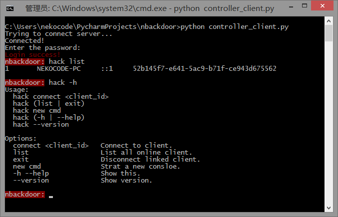

# nbackdoor
**backdoor system**

### Refactoring on the dev branch
- directly controler to client
- use normal socket to replace websocket
- job pools
- tools set：
  - Remote Desktop Protocol
  - ftp server
  - [PowerShell](http://drops.wooyun.org/tips/6090)
  - other usefull bat scripts
  - ...

- 管理员权限，绕过 UAC
- auto run
- auto pack to installer
- ...

### todo
- [x] 添加 from 字段
- [x] 安全密码输入
- [x] command-line help messages：https://github.com/docopt/docopt
- [x] 下载文件
- [x] ShowDialog 执行完毕返回 result 消息
- [x] console output redirect test
- [x] transfer buf (for 'chars')
- [x] arguments splite
- [x] 获取动态服务器 ip
- [x] esc 终止运行中的命令
- [ ] send_data 和 send_char 融合

## tofix
- [x] 执行 ShowDialog 命令，参数使用中文字符串失败
- [x] connect to client success 处理
- [ ] cat 测试

## note
- [pyinstaller](https://github.com/pyinstaller/pyinstaller)
- [cmd shell -> ftp upload](http://home.51.com/xiaobai521100/diary/item/10008446.html)

## screenshots

